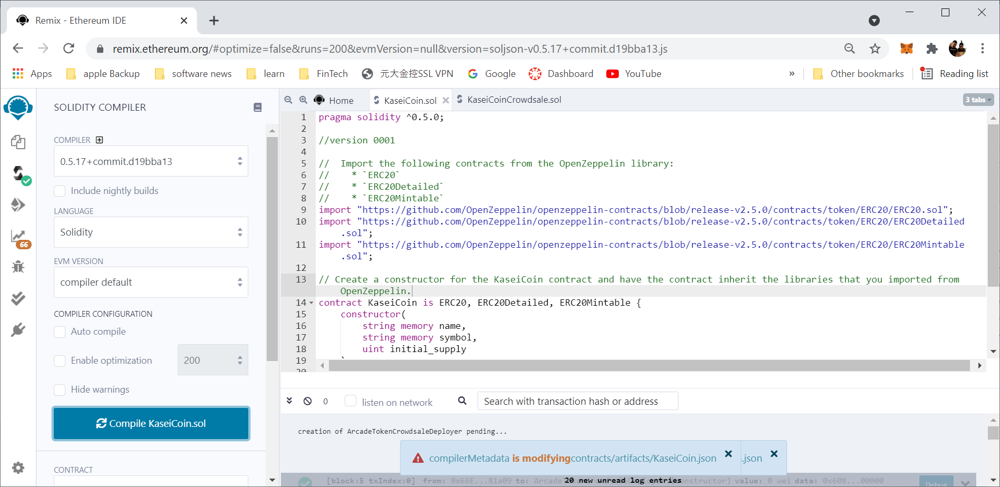
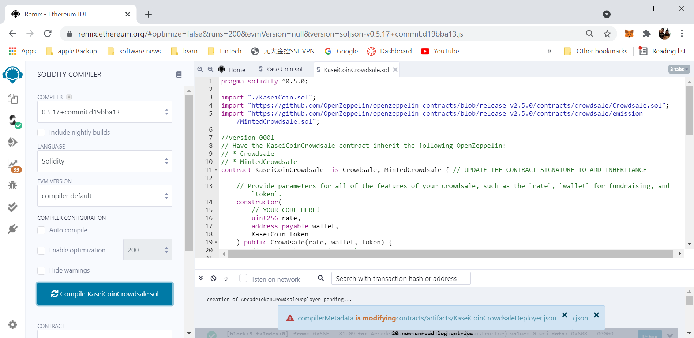

# Fin-Tech_Challenge_21_Kasei_Crowdsale

After waiting for years and passing several tests, you were selected by the Martian Aerospace Agency to be part of the first human colony on Mars. As a prominent fintech professional, you were chosen to lead a project to develop a monetary system for the new Mars colony. You have decided to base this new monetary system on blockchain technology, and to define a new cryptocurrency called **KaseiCoin**. (“Kasei” means “Mars” in Japanese.)

KaseiCoin will be a fungible token that is ERC-20 compliant. You will launch a crowdsale that will allow people who are moving to Mars to convert their earthling money to KaseiCoin.

## Evaluation Evidence

### Compile

## Technologies

* [Solidity](https://docs.soliditylang.org/en/v0.8.7/) - Solidity is an object-oriented, high-level language for implementing smart contracts. Smart contracts are programs which govern the behaviour of accounts within the Ethereum state.
* [Remix IDE](https://remix-ide.readthedocs.io/en/latest/) - Remix IDE is an open source web and desktop application. It fosters a fast development cycle and has a rich set of plugins with intuitive GUIs. Remix is used for the entire journey of contract development as well as being a playground for learning and teaching Ethereum.

## Installation Guide

Since web version of Remix IDE is provided, installation is not needed.

## Usage
